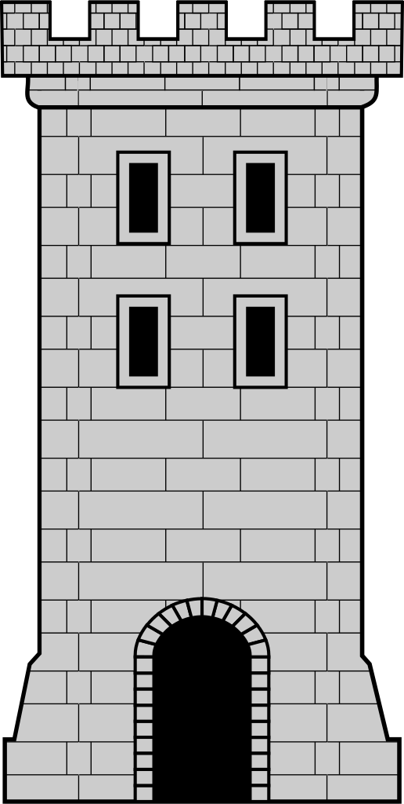

# Dukes-of-the-Realm

# Description du jeu

Dans ce mini jeu vidéo, l'objectif est de vaincre tout les dukes adverses présents dans , la partie s'achève lorsqu'il ne reste qu'un seul duke.

Les modes d'interactions sont les suivants :

	- On clique sur un château des châteaux pour pouvoir voir ses données
	- Pour attaquer, plusieurs étapes : 
		- On sélectionne un château qui nous appartient, celui-ci sera entouré d'un rectangle pour montrer qu'il a bien été selectionné (attention à bien cliquer sur la partie noire du château pour que votre choix soit pris en compte).

		- On appuie sur le bouton "build ost" pour pouvoir former une ost (seulement quand un château a été selectionné).

		- On ajoute une troupe à notre ost en faisant un clique gauche sur un des 3 boutons (chaque bouton correspond à un type de troupe) et on enlève une troupe en utilisant le clique droite la souris sur ce même bouton.

		- Ensuite, une fois l'ost choisi, on appuie sur le bouton attack pour lancer l'attaque.

	- Pour quitter la partie, le joueur devra soit cliquer sur la croix en ahut à droite de la fenêtre, ou appuyer sur la touche Esc (ECHAP) de son clavier.

La map du début est une map par défaut (les châteaux n'apparraissent pas aléatoirement).

# Image du jeu

Château ennemi :

Château allié :

château neutre :

#Les bons points

Le jeu contient bien les 3 types de troupes et différencie bien les châteaux ennemis, allié et neutre.
Lorsque le nombre de troupe d'une ost dépasse 3, ceux-ci sortent du château par groupes de 3 maximum.
Lors de l'attaque, l'ost se dirige bien vers la cible et attaque bien une troupes du château au hasard.
Une fois l'attaque effectués, les troupes sont supprimés.

#Les mauvais points

Il n'y a pas d'I.A. dans notre jeu.
On ne peut avoir aucune intéraction avec les châteaux neutres.

Certaines parties du code ne marche que parce que notre royaume ne contient qu'un château ennemi (facile à modifier mais manque de temps).

Après s'être rendu compte (trop tard) de ma mauvaise interprétation de la production de troupes, celle-ci se déroule comme ça :
	- Une fois l'ost choisi, celle-ci commmence à se former une fois que l'on aura appuyer sur le bouton attack, par conséquent le temps de production des troupes est respecté mais une fois prête, l'ost attaquera directement.
La gestion du nombre de troupes des châteaux est mal gérés au moment de l'attaque.

Plusieurs bugs et mauvais points sont arrivés lorsque j'ai traité le cas où seulement 3 troupes peuvent sortir en même temps du château et sera expliqué ci-dessous.
L'évenement de la sortie des troupes (3 par 3) est mal géré.

#Bugs du jeu compris

Lorsque le nombre de troupe d'une ost dépasse trois, deux bugs suivent :
	- le premier étant pendant la formation de l'ost, si on appuie sur attack, une exception est levé dû au fait que l'on modifie une liste pendant que celle-ci est parcouru (l'utilisation des iterateurs n'a pas été la solution).
	
	- le 2eme arrive au moment de la collision avec la cible, l'exception levé est la même pour la même raison.

#Problème non compris

Au début, les images des troupes s'enlevait au moment de où leur attaque a été effectué (donc quand ils sont supprimés), mais dans la version finale, non. Je n'ai pas réussi à comprendre pourquoi.